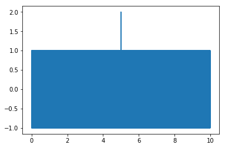

# Downsampling

This implements min/max downsampling as mentioned in [this NI article](http://zone.ni.com/reference/en-XX/help/371361H-01/lvconcepts/memory_management_for_large_data_sets/). The library allows downsampling of data while retaining the important high frequency events.

## Requirements

This is configured to build for python 3. There's no dependencies on that specific version, so you could modify the build scripts slightly to build for python 2.7. However, only support for python 3 is maintained here. (It's time to move on.)

From python you just need `numpy` installed.

```
pip install -r requirements.txt
```

or just

```
pip install numpy
```

The C++ code is built with CMake 3.9 and using `boost::python` with `numpy` array support (tested with version 1.65). Once you have those requirements, building is easy.

## Building

```
export BOOST_ROOT=/path/to/boost
python setup.py bdist_wheel
pip install dist/*.whl
```

## Usage

There's currently only one function implemented, `downsample.minmax`, which takes in a vector and the desired output length. Due to how the algorithm is specified, you'll actually get back a new vector four times the length you request. This is by design: the point is that it should return enough points to look good on an `N` pixel graph, which is at least `4*N` (you need at least two chunks for each pixel, and each chunk returns two values: a minimum and a maximum).

```
import numpy as np
import matplotlib.pyplot as plt
import downsample as ds

# Original data
t = np.linspace(0, 10, num=100000)
x = np.sin(2*3.14*100*t)
x[50000] = 2.

plt.plot(t, x)
```



```
xds = downsample.minmax(x, 1000)
tds = np.linspace(0, 10, num=xds.shape[0])

plt.plot(tds, xds)
```


(Note: After downsampling the odd peak is maintained.)

## License

This code is licensed under the [Creative Commons Attribution-ShareAlike 4.0 International license](https://creativecommons.org/licenses/by-sa/4.0/legalcode)